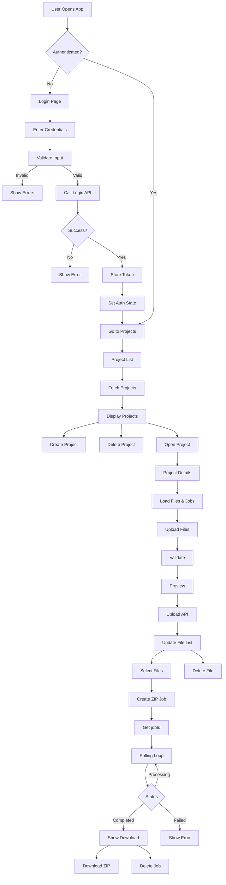

# Project-Centric File Processing Backend

A Node.js backend system where Projects are the primary domain entity, owning files and background processing jobs.

MONGODB is used for storage
files are saved on server local disk

### 1. users Table (Authentication)

- userID, userName, userEmail, password, role

### 2. projects

- id: Primary Key (UUID/Serial)
- name: String
- description: Text
- created_at: Timestamp

### 3. files

- id: Primary Key
- project_id: Foreign Key (References Projects)
- name: Original filename
- path: Storage location path (Disk/Object Storage)
- size: Bytes
- mime_type: File type
- uploaded_at: Timestamp

### 4. Jobs

- id: Primary Key
- project_id: Foreign Key (References Projects)
- type: Job type (e.g., 'ZIP_COMPRESSION')
- status: Enum (PENDING, PROCESSING, COMPLETED, FAILED)
- progress: Integer (0-100)
- output_file_id: Foreign Key (References Files, nullable)
- error: Text (nullable)
- created_at / started_at / completed_at: Timestamps

---

## Technical Logic

### Worker Threads

- CPU-intensive tasks (ZIP compression) are offloaded to **Worker Threads**.
- The main thread handles API requests and database initialization.
- Workers update the database directly to report progress and completion.

### Storage Strategy

- Files are stored on the filesystem under project-specific directories.
- Database only stores metadata and reference paths.
- Deleting a project triggers a cascade delete of DB records and physical file removal.

---

## API Endpoints

### Project Management

- POST /api/projects - Create project
- GET /api/projects/:id - Get details + file/job counts
- PUT /api/projects/:id - Update details
- DELETE /api/projects/:id - Delete project and all assets

### File Operations

- POST /api/projects/:id/files - Multi-file upload
- GET /api/projects/:id/files - List project files
- DELETE /api/projects/:id/files/:fileId - Delete specific file
- GET /api/projects/:id/files/:fileId/download - Download file

### Background Jobs

- POST /api/projects/:id/jobs/zip - Start ZIP job (Worker Thread)
- GET /api/projects/:id/jobs/:jobId - Check status & progress

---

## Setup & Installation

1. **Install Dependencies**: npm install
2. **Environment**: Configure .env .env.dev and .env.prod with DB credentials and upload path.
3. **Run**: npm run dev

## System Architecture

